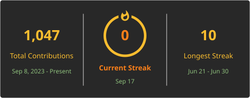

# Maryam Mahmood

**MS EE — AI & Autonomous Systems · NUST Islamabad · DAAD-Funded Thesis Project**

---

## About

Deploying autonomous systems into spaces shared with humans demands a shift from heuristic safety to **provable guarantees**. When a high-torque manipulator operates alongside a person, constraint satisfaction cannot be approximate.

My current research focuses on the formal and statistical frameworks that make such deployment defensible — validating them through end-to-end implementation on real hardware.

---

## Research

### CBF-QP Safety Filters

Forward-invariant safe sets via **Control Barrier Functions (CBFs)**. A min-norm quadratic program at each timestep preserves the nominal controller's intent while enforcing the safety constraint.

Validated across 8 systems in simulation:

- Inverted pendulum
- Cart-pole
- Dubins car
- Quadrotor
- Adaptive Cruise Control
- 2-DOF manipulator
- 3-DOF manipulator
- 7-DOF manipulator

### Conformal Prediction for Safety

I'm currently wrapping learned dynamics models with a distribution-free robustness margin `q_{1-δ}`, calibrated from held-out trajectories, that tightens the CLF decrease condition.

No parametric uncertainty model is assumed.

### 7-DOF Manipulator

Custom robotic arm using MyActuator RMD motors with a dual CAN-bus topology that reduces the control loop period from approximately **14 ms to 7 ms**.

I authored the complete ROS 2 stack, including:

- URDF/Xacro
- Custom `ros2_control` hardware interface
- MoveIt 2
- Gazebo simulation
- CAN communication
- Hardware bring-up
- Motion planning and control

---

## Projects

| Repository | Description |
|---|---|
| [`CRCLF_Inverted_Pendulum`](https://github.com/Maryam-Mahmood-1/CRCLF_Inverted_Pendulum) | Conformally robust CLF control — SINDy and PINN model classes under one conformal calibration layer |
| [`daadbot_manipulator`](https://github.com/Maryam-Mahmood-1/daadbot_manipulator) | Full ROS 2 stack for a custom 7-DOF arm — `ros2_control`, MoveIt 2, Gazebo, and hardware interface |

---

## Technical Skills

### Core Languages & Frameworks

  

- Python
- C++
- C
- MATLAB
- Control
- Robotics
- Simulation
- Research prototyping

### ML / AI

  

- PyTorch
- TensorFlow
- scikit-learn
- Learned dynamics
- SINDy
- Physics-Informed Neural Networks
- Conformal calibration
- Vision and ML-heavy robotics research

### Robotics & Control

  

- ROS 2
- `ros2_control`
- MoveIt 2
- Gazebo
- CBF-QP
- CLF-QP
- Conformal prediction
- URDF/Xacro
- Pinocchio
- MuJoCo
- Lyapunov stability
- Set invariance
- Convex optimization

### Tools & Systems

  

- Docker
- Git
- GitHub
- VS Code
- LaTeX
- Bash
- Ubuntu 22.04
- SocketCAN
- ESP32
- MCP2515
- MyActuator RMD-X8 / RMD-X6
- Intel RealSense D435i

---

## GitHub Stats

  
  

  

<!--
## Upcoming

- arXiv preprint — Statistical Safety Guarantees via Conformal CBFs
- CBF safety filter suite — public release
- ICRA 2027 submission
- Multi-CAN bus orchestrator for ros2_control
-->

---

  SEECS · NUST · Islamabad, Pakistan

